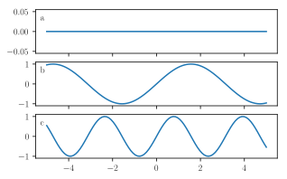
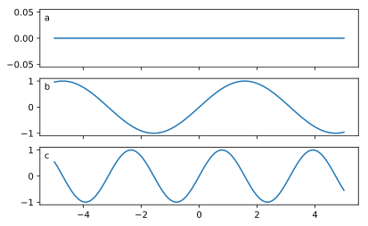

# DryTransfer

Style templates for Matplotlib figures.

## Quick example

Import style of the *Journal of Fluid Mechanics*:

```python
from DryTransfer import JFM as journal
print( journal.full_name )
```

```console
>>> Journal of Fluid Mechanics
```

We can now generate a figure:

```python
from pylab import *

fig, axs = subplots( nrows = 3, sharex = True )
x = linspace(-5,5,100)

for i, ax in enumerate(axs) :
    ax.plot( x, sin( i*x ) )
```

Templates come with convenient functions. For instance:

```python
journal.label_axes()
```

Here is the result:



To change journal style, simply import another template:

```python
from DryTransfer import PRL as journal
```

This is for *Physical Review Letters*. Here is the result:



## Documentation

[Here](./documentation/README.md).
