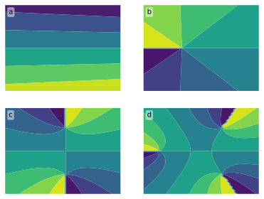

# DryTransfer `label_axes`

- [DryTransfer main page](../README.md)

## Basic usage

Generate a figure with subplots:

```python
from pylab import *

fig, axs = subplots( nrows = 2, ncols = 2 )

x = linspace(-1,1,50)
x, y = meshgrid( x, x )
z = x + 1j*y

for i, ax in enumerate( axs.flatten() ) :
    ax.contourf( x, y, angle( sqrt( z**i - .1*z + .3 ) ) )
    ax.axis('off')
```

Import `label_axes` from `DryTransfer.functions`, and use it:

```python
from DryTransfer.functions import label_axes

label_axes()
```

Here is the result:


