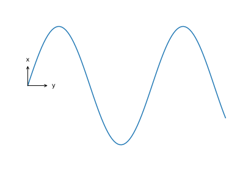

# DryTransfer `plot_frame`

- [DryTransfer main page](../README.md)

## Basic usage

Generate a figure:

```python
from pylab import *

x = linspace(0,10,100)
plot(x, 3*sin(x))
axis('equal')
axis('off')
```

Import `plot_frame` from `DryTransfer.functions` and use it:

```python
from DryTransfer.functions import plot_frame
plot_frame()
```

Here is the result:


